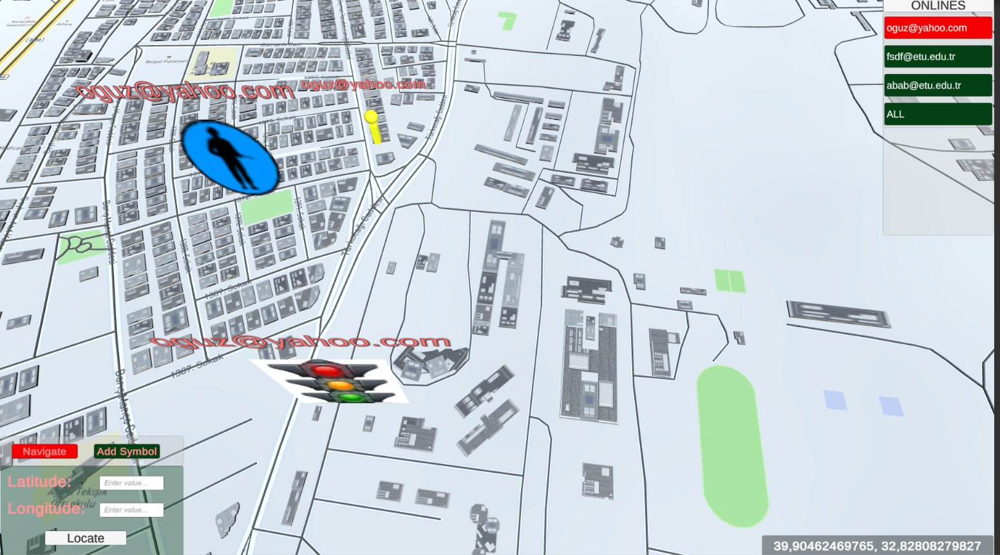
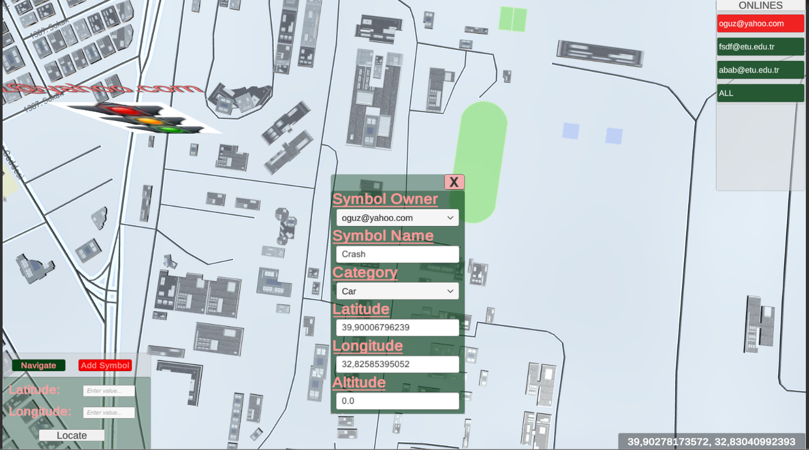
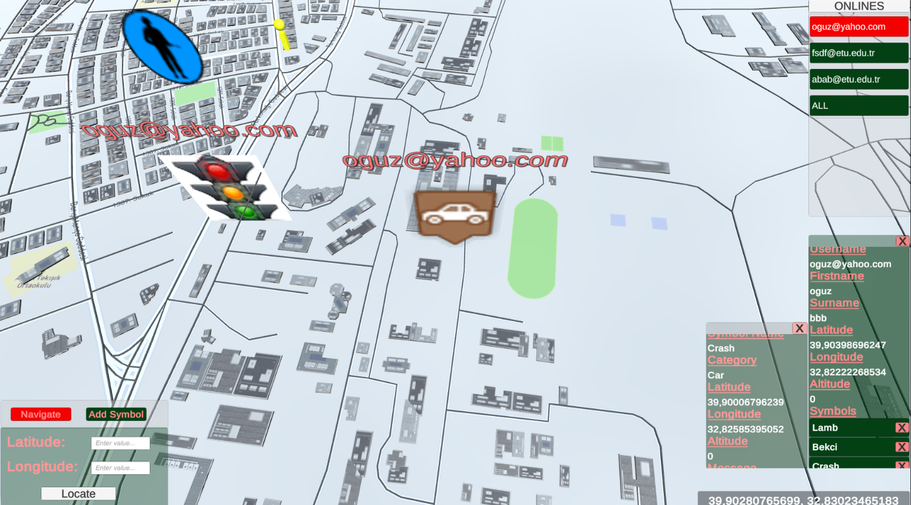
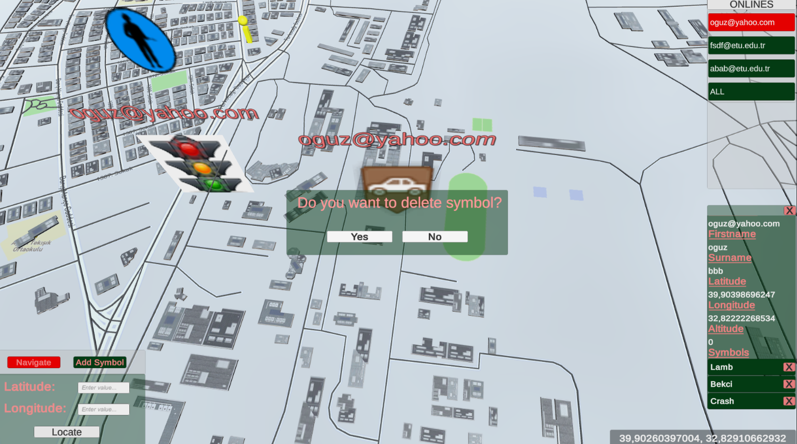
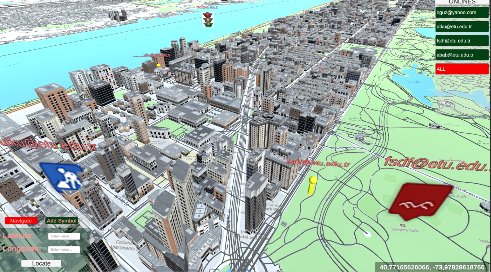

# Location_Based_AR_Admin
In this project main purpose is view all online users and their symbols on their locations on the map.

### Dependencies
This application build with Unity 2018.4.8. For connection between LocationBased_AR_User and LocationBaed_AR_Admin Amazon Web Services has been used. Moreover, Mapbox SDK has been used for mapping. 

**Application can be tested in Windows and Android environments.**

### Capabilities

- As a admin, you can see which users are online and by clicking you can see detail of this users, moreover you can this user's avatar centered on the camera.

- As a admin by clicking a online user, you can see this user's symbols and by clicking you can locate this symbol and see details of this symbol. 

- As a admin, you can pan, rotate and zoom in the map(Navigate Mode).

- As a admin, you can assign symbol to a user(Add Symbol Mode).

- As a admin, you can delete a symbol from a user.

- As a admin, you can search a place with latitude and longitude.

